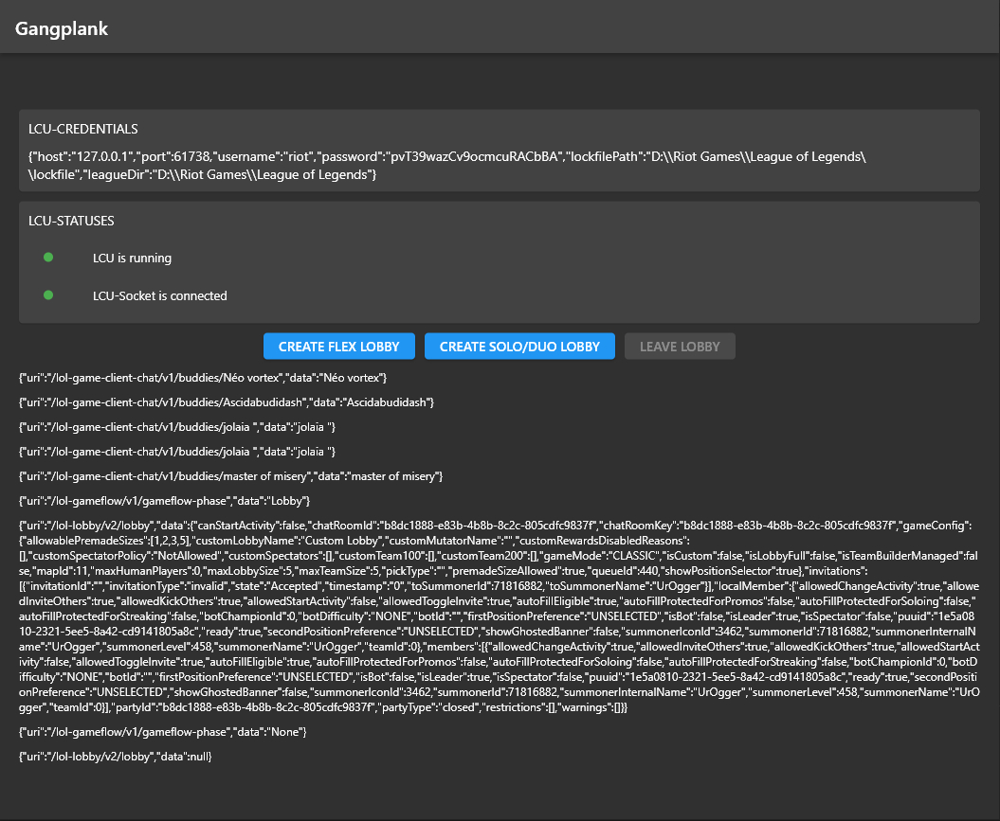

<!-- 
This README describes the package. If you publish this package to pub.dev,
this README's contents appear on the landing page for your package.

For information about how to write a good package README, see the guide for
[writing package pages](https://dart.dev/guides/libraries/writing-package-pages). 

For general information about developing packages, see the Dart guide for
[creating packages](https://dart.dev/guides/libraries/create-library-packages)
and the Flutter guide for
[developing packages and plugins](https://flutter.dev/developing-packages). 
-->

# Gangplank

Gangplank is a package designed to ease the use of the LCU (League client update) API. 
It provides multiple functionalities that are described below.
This package ONLY supports windows at the moment.



# Features

1. LCUWatcher watches your League client and will notify you when the client is started and/or closed.
2. LCUSocket is responsible for the websocket connection. It connects to the League client. You can subscribe to events you want to listen to.
3. LCUHttpClient provides the most common HTTP methods to send HTTP requests to the League client (e.g. create a lobby, start matchmaking etc.).

# Usage
## LCUWatcher and LCUSocket

The LCUWatcher is the first instance you need to use for the other services to work correctly. It watches your League client and extracts the needed credentials to connect to the League client. You CANNOT use the LCUSocket or LCUHttpClient before the onClientStarted event fired. After the LCUWatcher fired the onClientStarted event you can connect to the socket. When the socket is successfully connected the onConnect event will be fired. If the League client is closed and opened again all services will work again naturally, no need to handle anything yourself :)

```dart
final gp = Gangplank();

gp.watcher.onClientStarted.listen((credentials) {
    // IS CALLED WHEN THE LCUWATCHER FOUND A RUNNING LEAGUE CLIENT INSTANCE
    // NOW YOU CAN SAFELY USE THE LCUHTTPCLIENT

    /* THE CLIENT IS STARTED, YOU CAN NOW START CONNECTING TO THE WEBSOCKET THAT THE LEAGUE CLIENT EXPOSES*/
    // WHEN THE SOCKET SUCCESSFULLY CONNECTED IT WILL FIRE THE onConnect event

    gp.socket.connect();
});

gp.watcher.onClientClosed.listen((_) {
    // THE LEAGUE CLIENT IS CLOSED
});

gp.socket.onConnect.listen((_) {
    // THE SOCKET IS NOW CONNECTED
});

gp.socket.onDisconnect.listen((_) {
    // THE SOCKET IS NOW DISCONNECTED
});

// START WATCHING

gp.watcher.watch();
```

If you want to you can also manually make the LCUWatcher stop watching or disconnect the LCUSocket.

```dart
gp.watcher.stopWatching();
gp.socket.disconnect();
```

## Subscribe to socket events
You can subscribe to the same events multiple times in your application if you need it in different widgets/components/services. If the LCUSocket disconnects and reconnects the subscriptions will stay and will not be disposed. That means subscribing once is enough.

```dart
gp.socket.subscribe('*', (event) {
    // HERE YOU RECEIVE ALL EVENTS THE LEAGUE CLIENT FIRES
});

gp.socket.subscribe('/lol-lobby/v2/*', (event) {
    // YOU CAN USE WILDCARDS AT THE END OF THE GIVEN PATH
    // USING WILDCARDS WILL MATCH ALL EVENTS THAT START WITH GIVEN PATH BEFORE THE WILDCARD OPERATOR

});

gp.socket.subscribe('*/v2/lobby', (event) {
    // YOU CAN USE WILDCARDS AT THE START OF THE GIVEN PATH
    // USING WILDCARDS WILL MATCH ALL EVENTS THAT END WITH GIVEN PATH BEFORE THE WILDCARD OPERATOR
});

gp.socket.subscribe('/lol-lobby/v2/lobby', (event) {
    // YOU CAN ALSO JUST MATCH THE PATH COMPLETELY
});

// UNSUBSCRIBE FROM EVENT
gp.socket.unsubscribe('/lol-lobby/v2/lobby');
```

## Perform HTTP requests
As mentioned above, HTTP requests are only safe to perform when the onClientStarted event was fired. Otherwise an assert error will be thrown. The LCUHttpClient uses it's own exception class. This exception class called LCUHttpClientException includes the error message, the http status and error code provided by the League client when an error occurs.

### Create a lobby or leave it
```dart
try {
    // QUEUEID 440 WILL RESULT IN A FLEX RANKED LOBBY

    await gp.httpClient.post('/lol-lobby/v2/lobby', body: { 'queueId': 440 });
} catch (err) {
    // USING TOSTRING() WILL PRINT ALL PROPERTIES OF THE EXCEPTION

    print(err.toString());
}

try {
    // LEAVE THE CURRENT LOBBY

    await gp.httpClient.delete('/lol-lobby/v2/lobby');
} catch (err) {
    // USING TOSTRING() WILL PRINT ALL PROPERTIES OF THE EXCEPTION

    print(err.toString());
}
```

## Dispose resources
Most likely the Gangplank instance will be used the whole lifetime of your application in most cases, but if you decide to only use it as a part of your application be sure to call the dispose function on the Gangplank instance.

```dart
gp.dispose();
```
